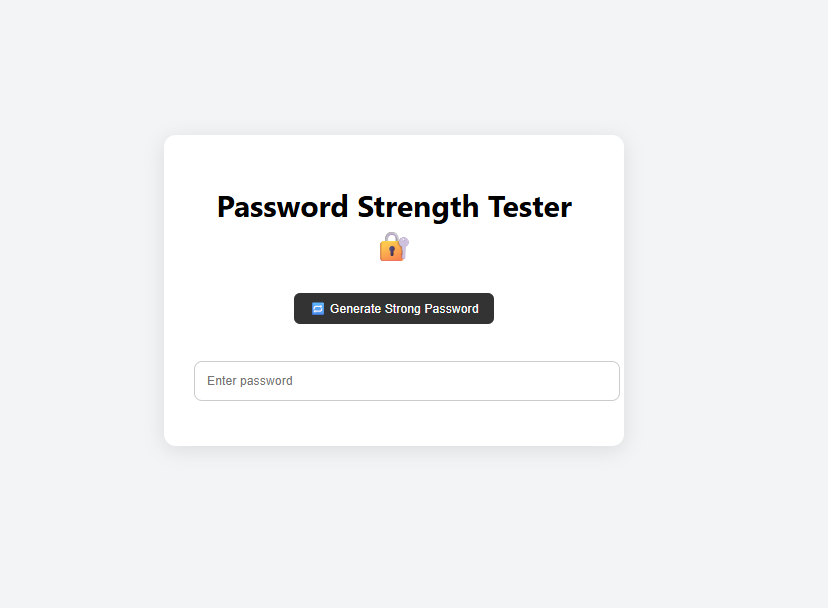
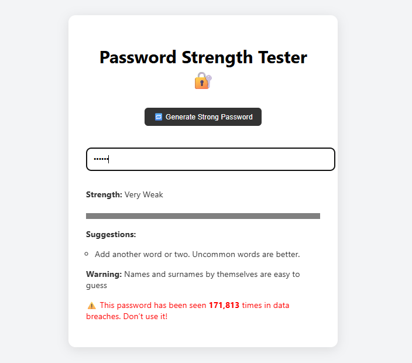
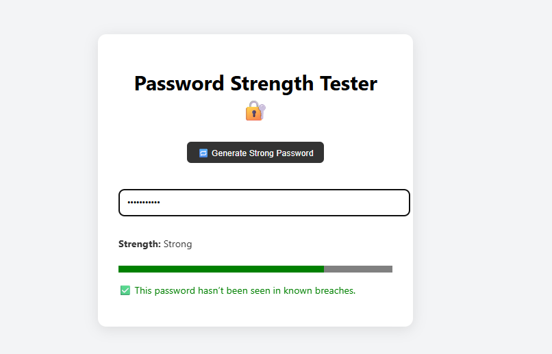
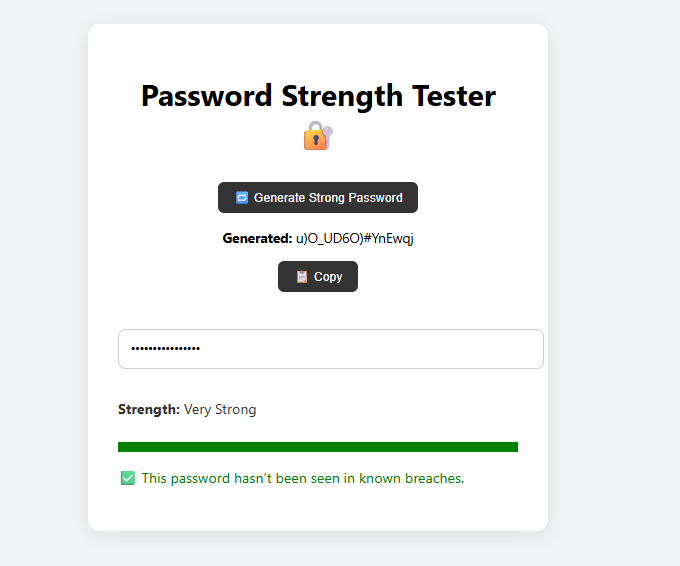

## 📝 PassGuard – Password Strength Tester

Your online bodyguard for passwords. Built for real users. Backed by real cybersecurity tools.
 

### 🔐 Overview

PassGuard is a modern, real-time password strength tester built with React and plain CSS.
It gives users actionable feedback on how secure their password is — while checking if it has ever appeared in known data breaches.

This is more than a toy project — it's a production-ready cybersecurity tool built for the web.

### 🎯 Why I Built This

In a digital world full of hacks, most people still use weak passwords like 123456 or their own name.
I wanted to build a tool that helps them do better — and proves my cybersecurity + software skills.


### ✨ Features

### Feature	Description

- Password Strength Checker	Analyzes in real-time using zxcvbn (by Dropbox)

- Human-Friendly Feedback	Suggests how to make weak passwords stronger
  
- Data Breach Detection	Uses HaveIBeenPwned API (with SHA-1 K-Anonymity) to check if the password is compromised
  
- Strong Password Generator	Generates random strong passwords with copy-to-clipboard
  
- Clean UI	Fully responsive with accessible feedback

- Built with React	Hook-based architecture and plain CSS styling

### 🧠 How It Works

- Password input triggers zxcvbn to score the password (0–4)

- Suggestions and warnings show instantly (e.g., "Too short", "Avoid common words")

- Password is hashed with SHA-1, only the first 5 characters are sent to the HaveIBeenPwned API (privacy preserved)

- Matches checked locally to see if the password is compromised

- Generator creates strong random passwords with symbols, numbers, and uppercase/lowercase letters

### 🛠 Tech Stack

- Frontend: React (Create React App)

- Styling: Pure CSS (no frameworks)

Security Tools:

- zxcvbn – password analysis

- js-sha1 – hashing

- HaveIBeenPwned API – breach detection

### 🚀 Live Demo

[Live demo here](https://passguard-drab.vercel.app/)

### 🧪 How to Run Locally

```bash

git clone https://github.com/your-username/passguard.git
cd passguard
npm install
npm start
```

### 💡 Future Enhancements

 - Store usage metrics (without logging passwords)

 - Dark mode

 - Browser extension version

 - Password history analyzer

### 📸 Screenshots

(Once deployed or you take screenshots, embed like so)







### Blog Post

[Blog Link](https://medium.com/@mugehajacky/from-weak-to-secure-building-a-real-world-password-analyzer-in-react-060bbe97f975)


### 🙋🏽‍♀️ About Me

I’m Jackie — a full-stack developer and cybersecurity enthusiast focused on building real tools for real problems.
If you’re hiring or collaborating, let’s talk.

"The best password is the one you didn’t use last year." – You, after using PassGuard 😎
